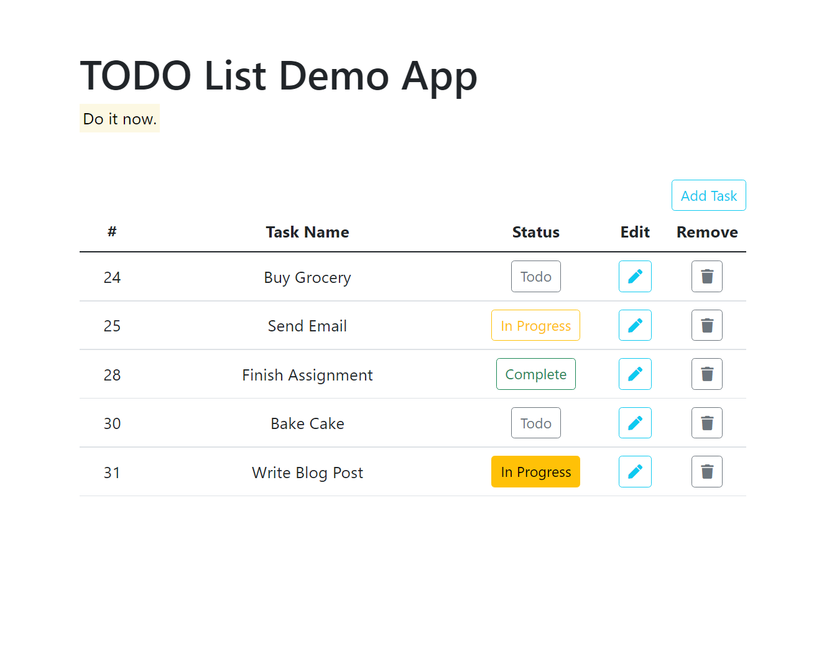

# html exercises


## #1 - img with external link

create page with image (tag img) loading image from external link, like "http://source-path.dominio.com/image.png"
references:
 * [\](https://developer.mozilla.org/en-US/docs/Web/HTML/Element/img)

 
## #2 - image with local link
create page with image (tag img) loading image local link, like "image.png"
references:
 * [\](https://developer.mozilla.org/en-US/docs/Web/HTML/Element/img)

 
## #3 - list
create a page with list with at least 10 items
references:
* [\<ul\>](https://developer.mozilla.org/en-US/docs/Web/HTML/Element/ul)


## #4 - page default colors
create a page and:
 - change page title to "exercise #4"
-  create css file with name 'main.css' and load in index.html 
 - change background color to dark grey
 - change text colors to white

references:
* [\<title\>](https://developer.mozilla.org/en-US/docs/Web/HTML/Element/title)
* [\<link\>](https://developer.mozilla.org/en-US/docs/Web/HTML/Element/link)
* [\<background-color\>](https://developer.mozilla.org/en-US/docs/Web/CSS/background-color)
* [\<color\>](https://developer.mozilla.org/en-US/docs/Web/CSS/color)


## #5 - profile page
create a basic profile page with:
 - photo
 - name
 - age

create files with this  structure:
```
index.html
assets/img/profile.png
assets/css/main.css
```

## 6 - table
create page with show list of family members and link to profile page:
- use table to display members in main page(index.html)
- each row has coluns: name, degree of kinship, age, city, and actions
last row, actions, is a link to profile page, with infos like photo, name, age, city

estructure example:
```
index.html
assets/css/
assets/profiles/
assets/img/
```


## 7 - todo app
create page following the image layout:




## 8 - flexbox

Learn how it works with the videos below:

videos:
* [Learn Flexbox CSS in 8 minutes](https://www.youtube.com/watch?v=phWxA89Dy94&ab_channel=SlayingTheDragon)
* [Flexbox CSS In 20 Minutes](https://www.youtube.com/watch?v=JJSoEo8JSnc&ab_channel=TraversyMedia)
 
and practice according to this tutorial:
* [Exercises in Flexbox](https://webdesign.tutsplus.com/exercises-in-flexbox-simple-web-components--cms-28049t)

